## Table of contents

[Español](./README_ES.md)

* [Presentation](#presentation)
  * [Characteristics](#characteristics)
  * [Requirements](#requirements)
* [Documentation](#documentation)
  * [Analysis](#analysis)
      * [Problem description](#problem-description)
      * [Impact](#impact)
      * [Background](#background)
      * [Objective](#objective)
      * [Scope](#scope)
      * [Out Of Scope](#out-of-scope)
      * [Cost](#cost)
      * [Benefit](#benefit)
      * [Future](#future)
      * [Functional Requirements](#functional-requirements)
      * [Non Functional Requirements](#non-functional-requirements)
      * [Risks](#risks)
      * [High Level Design](#high-level-design)
      * [Data Flow Analysis](#data-flow-analysis)
      * [Screen Analysis](#screen-analysis) 
  * [System Design](#system-design)
      * [Class Diagram](#class-diagram) (May be outdated)
      * [Architecture Modules](#architecture-modules)
      * [Color Palette](#color-palette)
      * [UI prototype](#ui-prototype)
* [Acknowledgements](#acknowledgements)

## Presentation

miSalle was a product for the students of the Universidad De La Salle Bajío,
but the server was blocked due to conflict of interests by the institution administration.
You can read more about it at [miSalle website](http://www.misalle.com.mx)

In this repository you will find the app of the product, which is the client of the system.
To see the server side please refer to [miSalle server on Github](https://github.com/lalo2302/miSalleScrapper)

To use the app you need univeristy expended credentials. For the security and privacy of the students of the institution
I will not provide a user. If you want to see the app you can download it on the Google Play Store [here](https://play.google.com/store/apps/details?id=monk.com.mx.misalleandroid)

### Characteristics

With miSalle you can get:

- Student personal information
- Schedule
- Credits
- Grades 

### Requirements

You will need an Android device with 5.1 or above

# Documentation

## Analysis

### Problem Description

The students of the Universidad De La Salle Bajío don't have a natural way of consume their relevant academic information.
With a natural way I want to say "a phone platform native way".

### Impact

**Student**

The student can check its information faster, so the interaction with its university will be improve,
making him to feel closer to the institution.

**Institution**

Proceses will be automatized with the general vision of the system, which means cost and time savings.
The school employees can spend their time in less repetitive tasks, improving the institution productivity in general.

### Background

At launch day, to see the next information:

- Schedule
- Grades
- Credits
- Teachers

the student needs to make the next steps:

1. Open web browser
2. Go to university website
3. Go to students website
4. Log in
5. Go to information website
6. Go to a webpage depending on what information he needs

At launch day there was no competition at all.

### Objective

Make a mobile solution to serve as intermediary between the student and the institution.

### Scope

miSalle will be part of processes that involve the student and what its called "college comunity".

### Out Of Scope

If a feature breaks the the relation student-"college comunity" is out of the scope of the project.

### Cost

- Money to pay the infrastructure
- Human resources
- Time

### Benefit

- There is no market competiton, so the system can reach the 100% of the school population
- This opens the possibility to work with the university
- This can open the oportunity to change the teaching system

### Future

Further in time, I can see the system doing the following:

- Credits details
- Show bachelor subjects
- Schedule by week
- The student will be able to track its absences without the need to wait for the system to register them
- The user will be able to create events and projects, so other students can join them
- Some type of network will be made between the business around the school and the students
- A pay option will be available within the app, thus the student doesn't need to go to the bank
- An evaluation system will be implemented to rate your teachers and subjects

### Functional Requirements

1. [x] The user will access the app with university credentials
2. [x] The system will show a daily schedule, only showing the student classes with its teacher's name
3. [x] The system will show the next class in case one exists
4. [x] The system will show the student's grades by period
5. [x] The system will show the student's social, cultural and sports credits
6. [x] The system will show how many days are left before the next payment's due date
7. [x] The system will show the student's absences by subject
8. [x] The system will show the student's name, enrollment number and bachelor
9. [x] The student will upload a picture to its personal information

### Non Functional Requirements

1. The system will get the information using web scrapping
2. The client of the system needs to be a mobile application
3. The application will exists in Android an iOS platforms, making Android a priority
4. The system will give access only to those who have university expended credentials
5. The application needs to be capable of displaying the student's information without an internet connection

### Risks

#### IP blocked by the institution (This happened)

##### Description
By taking advantage of a vulnerability, and accesing the information by web scrapping, the institution can detect the 
traffic spike and just block the IP of the system.

##### Severity
**High**
It is the main source of information.

##### Action
1. The [Arquitecture](#high-level-design) shows how the tiers are distributed. The scrapper being hosted on Heroku, gives the system a dynamic IP. So if this risk happens, it only takes to restart the dyno to get a different IP
2. Keeping the information offline in the student's device, while the dyno restart takes place, the users wont notice the event

##### Result
This risk happened and led to the shutdown of the service. I underestimated the technology department of the institution,
and I wasn't prepared enough to overcome the blocking.

#### Change of the institution website

##### Description
Webscrapping is how the system gets the students information, so this means that it is heavily dependent on how the 
website html is structured due to the lack of css selectors to navigate it.

##### Severity
**Medium**
Every change done to the institution's website, needs to be adjusted in the system.

##### Probability
**Low**
The website is poorly designed, being only a sequence of html tables and by analysing it, heavily attached to how the
information is stored in the institution database. Thanks to my expirience as a student at the institution, I observed
that burocracy slows down any effort to change something, so a change seems hard to happened.

Also it is known that on the first semester of the year, the institution revise the budget to put it to work on the 
second half of the year. The system being launched at August 2017, gives us a window of opportunity of almost a year 
to create a solid user base.

##### Action
Designing the system following SOLID principles and Separation of Concerns, so when change comes, it can happend without
affecting other components.

#### Lack of income ($$$)

##### Descripción
The project doesn't have have any sponsors to pay for the servers, so for a start the costs will be covered by me 
(Eduardo). This brings a limitation of funding to hire new developers and scaling the infrastructure.

##### Severity
**Medium**
The initial inversion doesn't represent much of a problem in a short term plan. By the time the server load increases,
a solid user base will exists, which brings the opportunity to atract funding.

##### Probability
**Medium**
I don't have the expirience to make a real estimation of how much the system will cost related to its traffic.

##### Action
1. A free private git repository will be used for the development
2. An ad centric business model will be utilized

### High Level Design

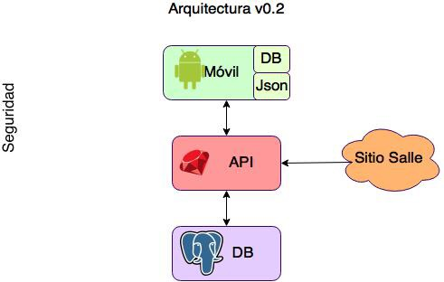

### Data Flow Analysis

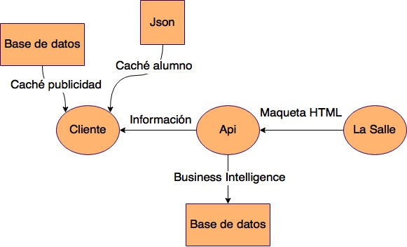

### Screen Analysis

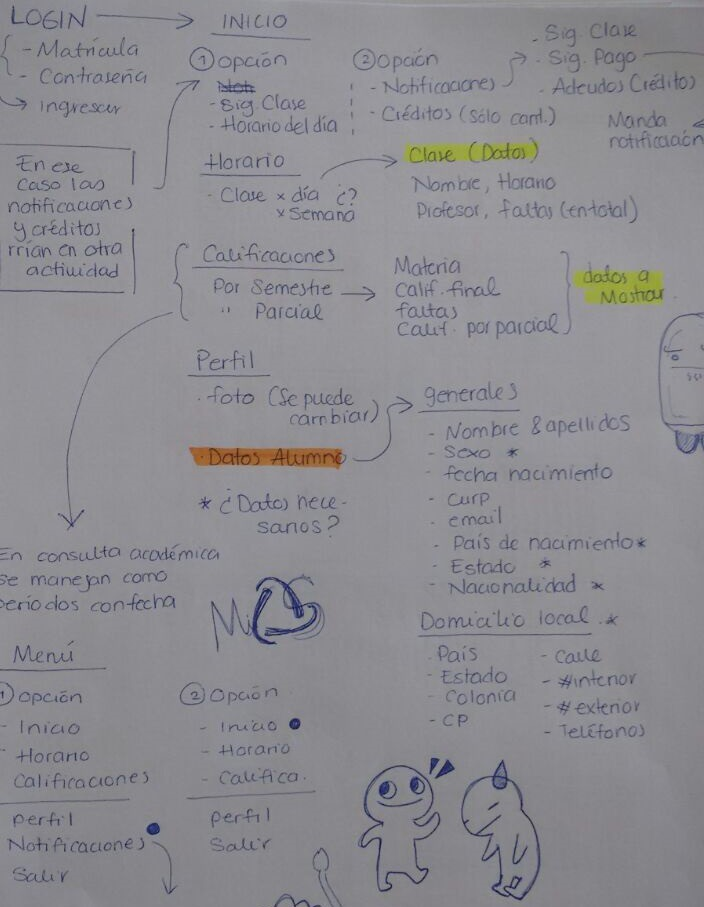

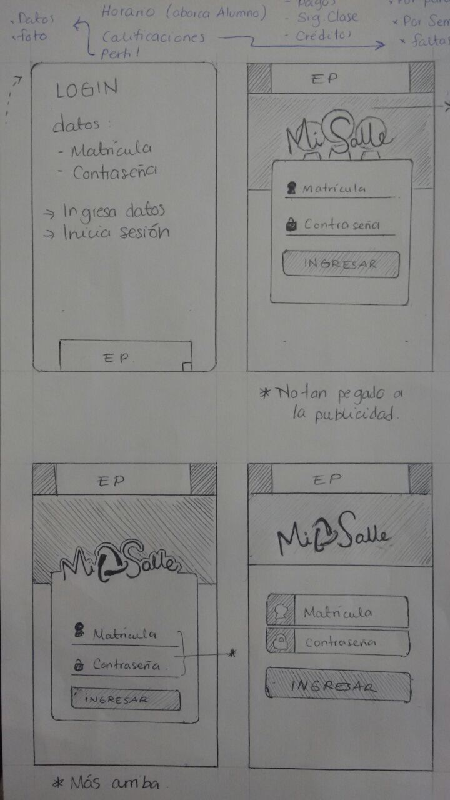

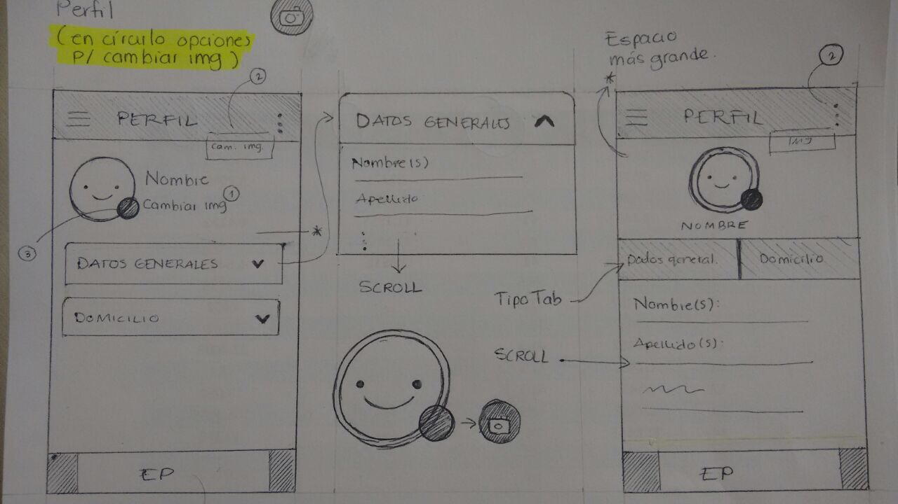

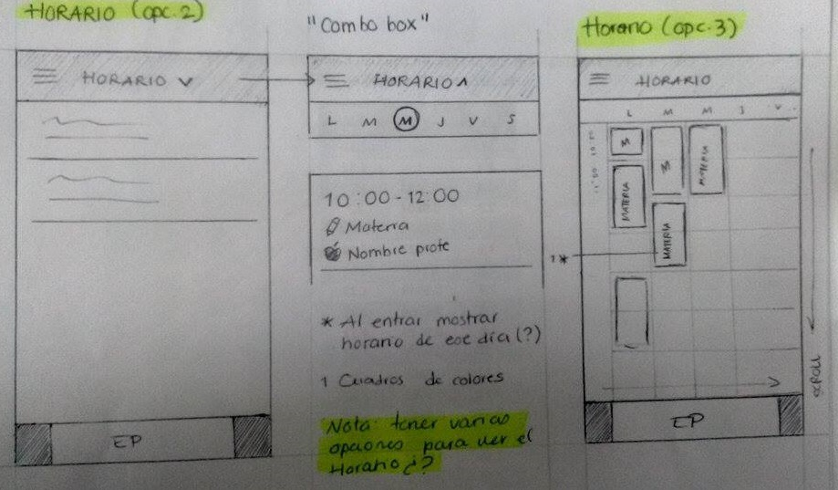

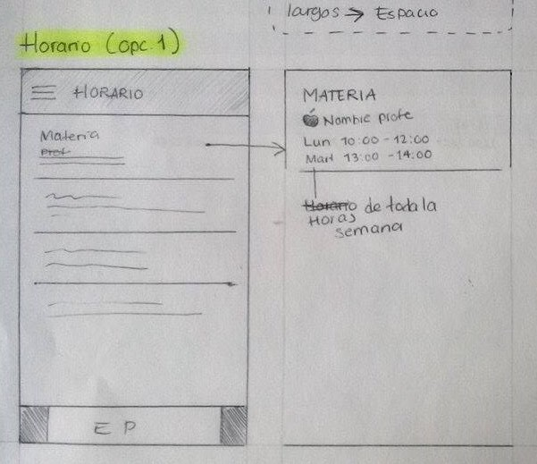

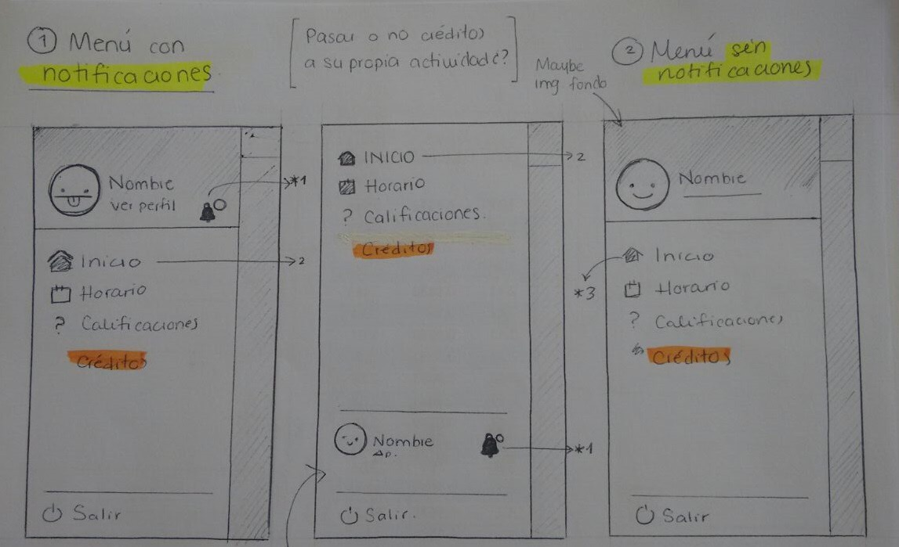

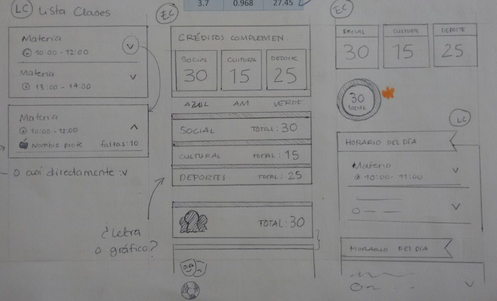

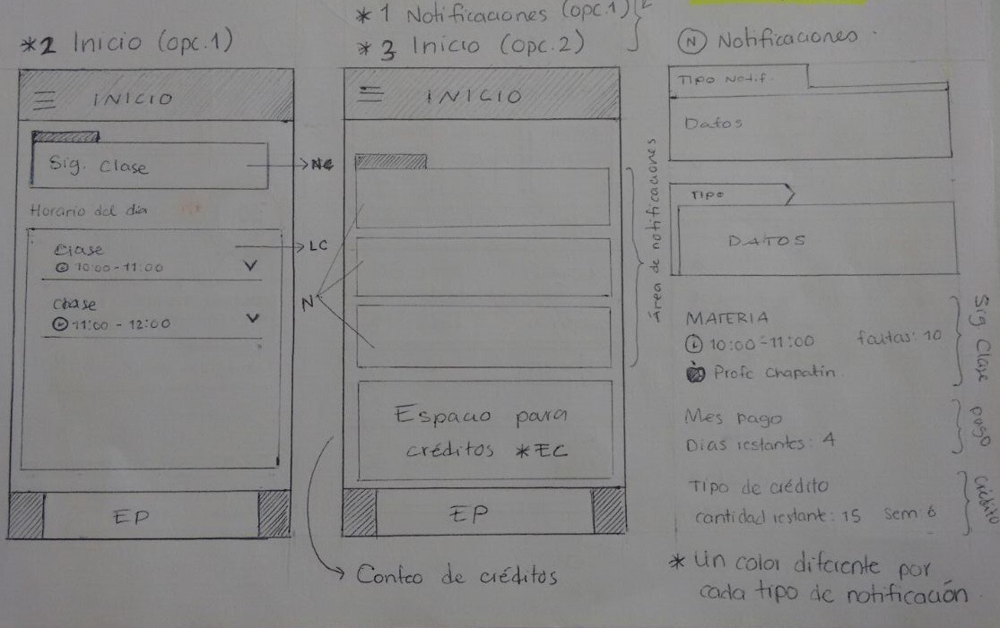

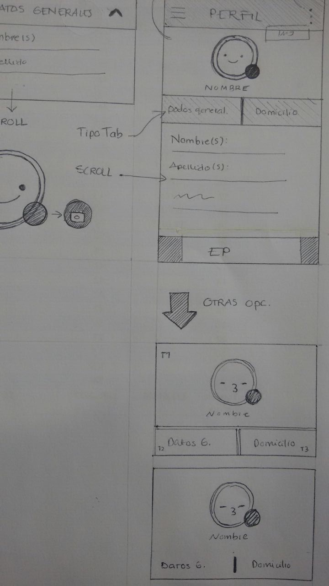

## System Design

### Class Diagram (May be outdated)

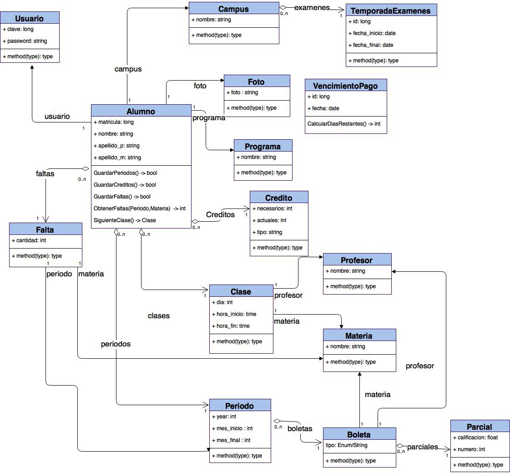

### Architecture Modules

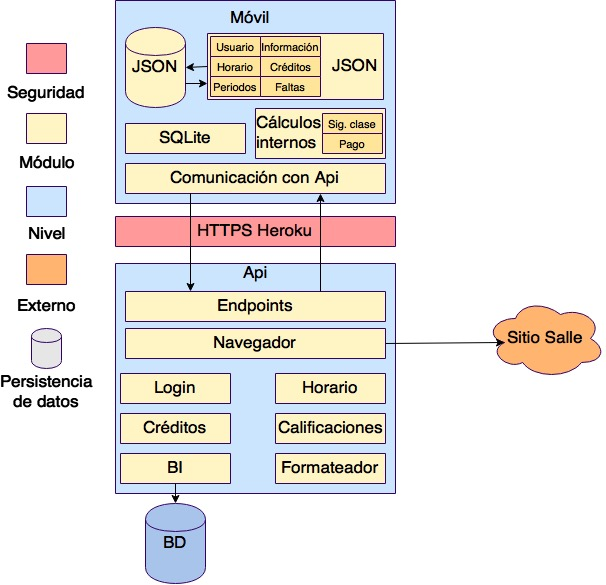

### Color Palette

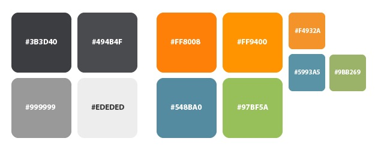

### UI Prototype

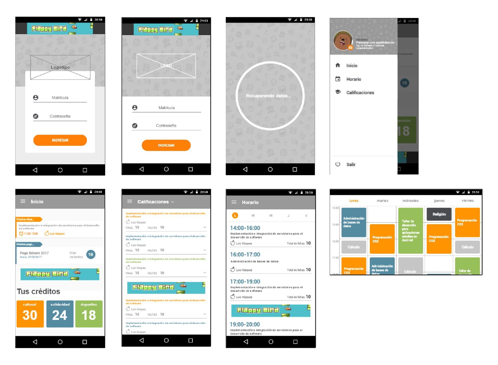

# Aknowledgements

A special mention to Andrea Hernández De Alba, for her initial colaboration in the project, making the UI design,
the frontend and part of the development of the Android app.
